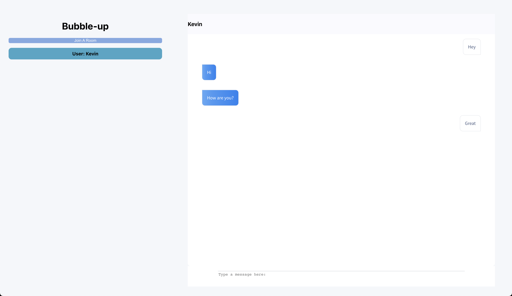
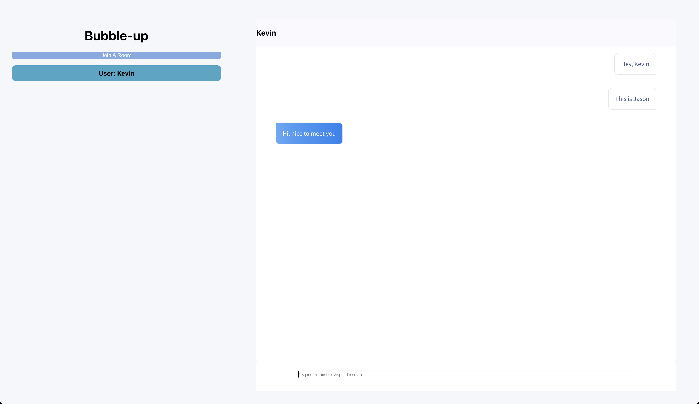
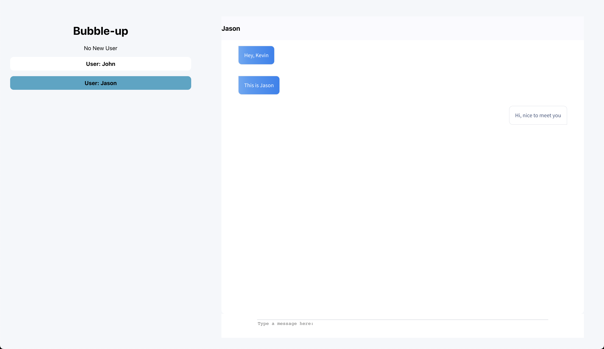
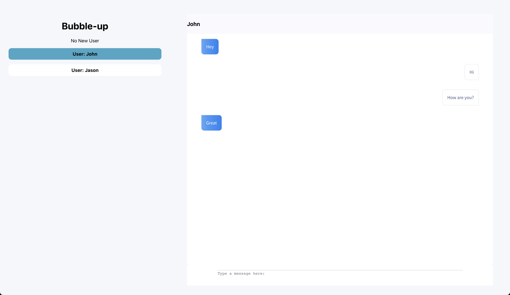

# Bubble Up
---
Bublle up is a real time chatting application where users can meet new people around the world. 

---
# Bubble-up

When the page is loaded, you will be introduced with this page
To start chatting insert your name and press Start Chatting

Main Page: To find a new random user press `Join a Room`

Once you are joined with a random user, you will be directed to this page
You will be able to start chatting with the connected user. The room is automatically selected when joined, so you can start chatting right away.

Showcasing the interface for `Bubble-up` realtime chatting app.
||||
|-|-|-|

User Interface when there is no new user to start a chat.

The app automatically shows messges that is asociated with the room in focus.

|||
|-|-|

